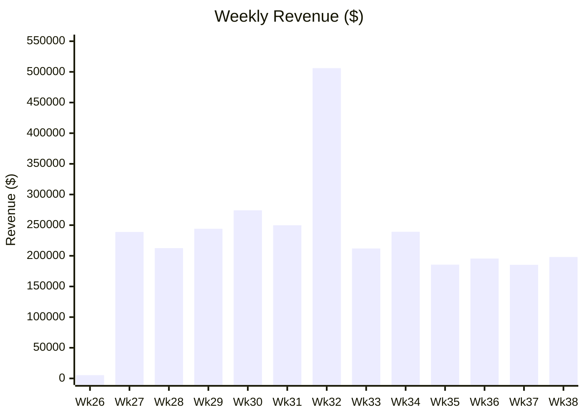
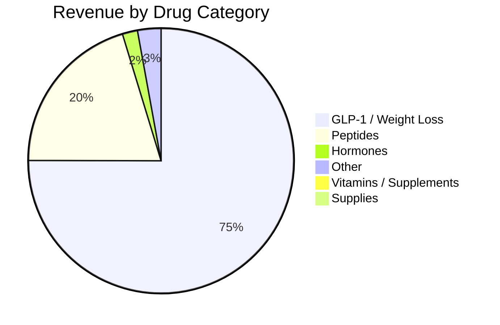

# 📊 JMS Order Index

📂 View Full Drug Catalog

### GLP-1 / Weight Loss
| Drug | Revenue | Orders |
|---|---:|---:|
| Tirzepatide Compound | $616,454 | 1,486 |
...
## 📈 Revenue by Week

[README.md](https://github.com/user-attachments/files/28351776/README.md)
# Metabase Bulk Order Index
**Data as of:** 2026-05-24 · **Weeks covered:** 26–38 · **Source:** BoomRx + Bulk

---

## Contents

- [Overview](#overview)
- [Revenue by Rep](#revenue-by-rep)
- [Revenue by Week](#revenue-by-week)
- [Revenue by Drug Category](#revenue-by-drug-category)
- [Top Drugs by Revenue](#top-drugs-by-revenue)
- [Top Clinics by Revenue](#top-clinics-by-revenue)
- [Revenue by State](#revenue-by-state)
- [Drug Catalog by Category](#drug-catalog-by-category)
- [Data Dictionary](#data-dictionary)

---

## Overview

| Metric | Value |
|---|---|
| Total order lines | 16,232 |
| Total revenue (subtotal) | $2,946,838 |
| Unique clinics | 564 |
| Unique drugs / SKUs | 217 |
| Sales reps | 6 |
| Order weeks | 26 – 38 |
| Order sources | BoomRx, Bulk |
| Statuses | shipped, received, delivered, completed |

---

## Revenue by Rep

| Rep | Revenue | Orders | Clinics | Drugs |
|---|---:|---:|---:|---:|
| JMS - Jack/ Mark | $2,099,262 | 12,721 | 363 | 163 |
| JMS - Erin Ryan Snyder | $600,496 | 2,131 | 133 | 126 |
| JMS - Zachary Salazar | $207,641 | 1,007 | 39 | 100 |
| JMS - Dylan White | $27,318 | 188 | 22 | 48 |
| JMS - Jonathan Izquierdo | $6,753 | 151 | 6 | 23 |
| JMS - Ashlyn Smith | $5,368 | 34 | 2 | 14 |

**Top drug per rep:**

| Rep | #1 Drug | Revenue |
|---|---|---:|
| JMS - Jack/ Mark | Tirzepatide Compound | $485,562 |
| JMS - Erin Ryan Snyder | Tirzepatide Compound | $107,706 |
| JMS - Zachary Salazar | Tirzepatide / B12 | $39,705 |
| JMS - Dylan White | Tirzepatide / Glycine / Methylcobalamin | $5,157 |
| JMS - Jonathan Izquierdo | Testosterone Cypionate - MCT | $1,155 |
| JMS - Ashlyn Smith | Tirzepatide / Glycine | $1,275 |

## 💊 Revenue by Category

---

## Revenue by Week

| Week | Revenue | Orders |
|---:|---:|---:|
| 26 | $5,369 | 52 |
| 27 | $238,919 | 1,025 |
| 28 | $212,569 | 1,025 |
| 29 | $244,130 | 1,081 |
| 30 | $274,233 | 1,134 |
| 31 | $249,842 | 1,204 |
| **32** | **$506,050** | **1,609** |
| 33 | $212,013 | 1,469 |
| 34 | $239,233 | 1,632 |
| 35 | $185,600 | 1,402 |
| 36 | $195,575 | 1,574 |
| 37 | $185,293 | 1,589 |
| 38 | $198,012 | 1,436 |

> Week 32 was the highest-revenue week at $506,050 (17% of total).

---

## Revenue by Drug Category

| Category | Revenue | Orders | Unique Drugs |
|---|---:|---:|---:|
| GLP-1 / Weight Loss | $2,200,526 | 9,666 | 75 |
| Peptides | $593,970 | 3,793 | 36 |
| Other | $83,736 | 696 | 67 |
| Hormones | $54,099 | 1,197 | 27 |
| Vitamins / Supplements | $8,384 | 137 | 9 |
| Supplies | $6,123 | 743 | 3 |

---

## Top Drugs by Revenue

| Drug | Revenue | Orders | Qty |
|---|---:|---:|---:|
| Tirzepatide Compound | $616,454 | 1,486 | 3,391 |
| Tirzepatide / Glycine | $468,103 | 3,201 | 3,808 |
| Tirzepatide / B12 | $314,796 | 1,712 | 2,122 |
| Tirzepatide / Glycine / Methylcobalamin | $106,986 | 577 | 711 |
| Semaglutide (Compound) | $106,227 | 503 | 1,244 |
| BPC-157 / GHK-Cu / KPV / TB-500 | $77,000 | 453 | 541 |
| BPC-157 / TB-500 | $74,765 | 435 | 516 |
| Semaglutide / B3 | $65,464 | 659 | 888 |
| Tesamorelin | $64,750 | 388 | 541 |
| CJC-1295 / Ipamorelin | $62,830 | 358 | 449 |
| Semaglutide / B12 | $54,406 | 639 | 745 |
| Tesamorelin / Ipamorelin | $43,715 | 227 | 300 |
| GHK-Cu | $42,760 | 274 | 362 |
| Semaglutide / Glycine | $33,739 | 280 | 402 |
| MOTS-c | $33,870 | 252 | 288 |
| BPC-157 / TB-500 / GHK-Cu | $35,970 | 202 | 249 |
| BPC-157 / KPV / TB-500 | $33,755 | 192 | 237 |
| Tirzepatide / L-Carnitine | $30,420 | 159 | 199 |
| NAD+ | $27,957 | 281 | 392 |
| BPC-157 | $26,740 | 203 | 231 |
| Sermorelin | $24,288 | 263 | 366 |
| Nandrolone Decanoate | $13,590 | 93 | 182 |
| Thymosin A-1 | $11,180 | 84 | — |
| Tirzepatide / Glycine / B12 | $11,840 | 53 | — |
| Semaglutide / L-Carnitine | $11,527 | 76 | — |

---

## Top Clinics by Revenue

| Clinic | Revenue | Orders | Drugs |
|---|---:|---:|---:|
| The DripBar Grand Forks | $88,011 | 191 | 10 |
| JumpStartMD | $80,667 | 1,030 | 11 |
| Talon Wellness | $67,262 | 621 | 30 |
| Camden Cosmetics LLC | $60,021 | 150 | 12 |
| Restoration Wellness, LLC | $51,789 | 297 | 11 |
| Revitalize You Weight Loss Center LLC | $43,950 | 67 | 4 |
| Stocks Medical, PLLC | $42,691 | 47 | 10 |
| New Beginnings Wellness Clinic | $41,460 | 433 | 17 |
| 207 Wellness, LLC | $35,544 | 234 | 18 |
| Evolved Medical | $33,695 | 69 | 8 |
| Veritas Medical Center | $32,970 | 27 | 1 |
| Metromed Health | $31,334 | 103 | 14 |
| Drexler Aesthetics & Weight Loss | $30,756 | 106 | 23 |
| Mountain Medical Associates | $29,995 | 5 | 5 |
| Sunmed Health and Weight Management | $29,963 | 279 | 10 |
| Balanced Weight Loss Solutions | $29,380 | 198 | 5 |
| 129 Health & Wellness | $28,780 | 151 | 15 |
| White Lotus Aesthetics & Wellness | $27,750 | 26 | 6 |
| Virginia Healthy Weight | $26,827 | 229 | 10 |
| Osita Health Clinic | $26,526 | 53 | 7 |
| UltraTrim Clinic of VA | $24,871 | 52 | 13 |
| MedFIT Weight Loss and Wellness | $24,695 | 229 | 13 |
| Peptides First | $23,469 | 233 | 38 |
| The Hansell Center for Functional Medicine, PLLC | $23,322 | 176 | 19 |
| Evolve Anti-Aging and Wellness | $22,785 | 28 | 4 |
| Lifestyle Physicians | $22,689 | 167 | 24 |
| Juvenis Medical | $22,566 | 154 | 17 |
| Denver Regenerative Medicine | $22,035 | 95 | 17 |
| Beaute PC | $21,690 | 221 | 26 |
| Reno Premier Medicine, PLLC | $20,520 | 27 | 2 |
| Mountain Park Medical Aesthetics & Wellness, PLLC | $20,304 | 63 | 9 |
| Restore Functional Medicine | $19,250 | 117 | 9 |
| Reset TRT & Weight Loss | $19,175 | 105 | 5 |
| SP Wellness Company | $18,469 | 165 | 13 |
| Badillo Longevity Lab | $18,212 | 115 | 19 |
| Holloway Health LLC | $18,132 | 116 | 16 |
| UltraTrim Clinic of NC | $18,113 | 31 | 10 |
| Seaside; Primary Care, Weight Loss & HRT Clinic | $18,088 | 31 | 9 |
| Optimal Wellness Group LLC | $17,905 | 116 | 28 |
| LOU LOU Med Spa | $17,781 | 231 | 23 |

---

## Revenue by State

| State | Revenue | Orders |
|---|---:|---:|
| CA | $362,624 | 2,659 |
| FL | $316,217 | 1,939 |
| TX | $134,614 | 879 |
| SC | $131,077 | 446 |
| NV | $129,133 | 908 |
| NC | $116,129 | 661 |
| AR | $99,214 | 547 |
| ND | $94,094 | 214 |
| VA | $83,460 | 501 |
| MN | $80,345 | 429 |
| TN | $72,301 | 380 |
| MD | $70,611 | 532 |
| OH | $64,970 | 586 |
| ME | $64,360 | 448 |
| MI | $60,723 | 491 |
| NJ | $53,511 | 326 |
| OK | $49,464 | 426 |
| NY | $48,100 | 85 |
| GA | $41,989 | 321 |
| LA | $41,488 | 309 |

---

## Drug Catalog by Category

### GLP-1 / Weight Loss

| Drug | Revenue | Orders |
|---|---:|---:|
| Tirzepatide Compound | $616,454 | 1,486 |
| Tirzepatide / Glycine | $468,103 | 3,201 |
| Tirzepatide / B12 | $314,796 | 1,712 |
| Tirzepatide / Glycine / Methylcobalamin | $106,986 | 577 |
| Semaglutide (Compound) | $106,227 | 503 |
| Semaglutide / B3 | $65,464 | 659 |
| Semaglutide / B12 | $54,406 | 639 |
| Semaglutide / Glycine | $33,739 | 280 |
| Tirzepatide / L-Carnitine | $30,420 | 159 |
| Tirzepatide / Glycine / B12 | $11,840 | 53 |
| Semaglutide / L-Carnitine | $11,527 | 76 |
| Tirzepatide (30 Day) | $7,675 | 47 |
| Semaglutide / Methylcobalamin / Glycine | $6,970 | 59 |
| Semaglutide (30 Day) | $5,329 | 36 |
| Semaglutide / Glycine / B12 | $2,820 | 25 |
| Tirzepatide (30 Ampules - various strengths) | $2,600 | 13 |
| Semaglutide (30 Ampules - various strengths) | $810 | 6 |
| *503B Bulk Compounded Tirzepatide / Semaglutide (various)* | *~$430,000* | *163* |

### Peptides

| Drug | Revenue | Orders |
|---|---:|---:|
| BPC-157 / GHK-Cu / KPV / TB-500 | $77,000 | 453 |
| BPC-157 / TB-500 | $74,765 | 435 |
| Tesamorelin | $64,750 | 388 |
| CJC-1295 / Ipamorelin | $62,830 | 358 |
| Tesamorelin / Ipamorelin | $43,715 | 227 |
| GHK-Cu | $42,760 | 274 |
| BPC-157 / TB-500 / GHK-Cu | $35,970 | 202 |
| MOTS-c | $33,870 | 252 |
| BPC-157 / KPV / TB-500 | $33,755 | 192 |
| NAD+ | $27,957 | 281 |
| BPC-157 | $26,740 | 203 |
| Sermorelin | $24,288 | 263 |
| Thymosin A-1 | $11,180 | 84 |
| MOTS-c / Tesamorelin | $4,740 | 28 |
| DSIP | $4,395 | 33 |
| BPC-157 Acetate | $4,352 | 40 |
| GHK-Cu / Epithalon | $3,180 | 17 |
| DSIP / BPC-157 / CJC-1295 | $3,510 | 15 |
| GHK-Cu Cosmetic Cream | $2,450 | 19 |
| GHK-Cu / Hyaluronic Acid / Hydroquinone / Niacinamide | $1,560 | 10 |
| *503B Bulk Compounded NAD+ / Sermorelin / Glutathione (various)* | *~$10,000* | *various* |

### Hormones

| Drug | Revenue | Orders |
|---|---:|---:|
| Nandrolone Decanoate | $13,590 | 93 |
| Testosterone Cypionate - MCT | $8,631 | 335 |
| Testosterone Cypionate - Commercial | $6,755 | 88 |
| Progesterone IR | $6,352 | 109 |
| Testosterone Cypionate - GSO | $5,427 | 262 |
| Testosterone (Topi-Click) | $4,750 | 115 |
| Progesterone SR | $2,415 | 42 |
| Testosterone Enanthate - MCT | $1,085 | 33 |
| Testosterone Enanthate - GSO | $980 | 27 |
| Estradiol Cypionate MCT | $845 | 16 |
| Progesterone IR (Dye-Free) | $650 | 16 |
| Estradiol (Topi-Click) | $510 | 16 |
| DHEA SR | $502 | 9 |
| Progesterone (Topi-Click) | $240 | 5 |
| Estradiol | $210 | 5 |
| DHEA / Pregnenolone | $201 | 3 |
| Testosterone SR | $216 | 4 |
| Estradiol (Versabase) | $120 | 4 |
| Estradiol / Progesterone (Topi-Click) | $80 | 2 |
| Biest (50:50) / Progesterone SR | $36 | 1 |

### Vitamins / Supplements

| Drug | Revenue | Orders |
|---|---:|---:|
| Glutathione | $4,542 | 92 |
| Cyanocobalamin (B12) - Commercial | $1,008 | 17 |
| Methylene Blue | $621 | 7 |
| Methylcobalamin (B12) | $420 | 13 |
| MIC / B12 | $100 | 4 |

### Other (Select)

| Drug | Revenue | Orders |
|---|---:|---:|
| Semax / Selank | $7,900 | 50 |
| IGF-LR3 | $7,460 | 51 |
| SS-31 | $6,360 | 50 |
| HCG (Chorionic) | $4,830 | 22 |
| Enclomiphene Citrate | $4,807 | 77 |
| Melanotan II | $4,420 | 32 |
| Epithalon | $3,860 | 24 |
| Kisspeptin | $3,080 | 22 |
| Lipo-B | $2,940 | 36 |
| PT-141 | $2,860 | 23 |
| Clomiphene Citrate | $1,563 | 17 |
| Naltrexone | $1,445 | 32 |
| Ibutamoren MK-677 | $1,425 | 7 |
| SLU-PP-332 | $1,499 | 11 |
| Tadalafil | $723 | 9 |
| Oxandrolone | $1,131 | 6 |
| Anastrozole | $499 | 28 |

### Supplies

| Drug | Revenue | Orders |
|---|---:|---:|
| Syringe w/ Attached Needle | $4,302 | 457 |
| Needle Tips | $1,026 | 175 |
| Luer Lock | $794 | 111 |

---

## Data Dictionary

| Column | Description |
|---|---|
| `Source` | Order platform — `BoomRx` or `Bulk` |
| `order_date` | Date order was placed (serial number format) |
| `Order Week` | ISO week number of order date |
| `Order Month` | Month of order (serial number format) |
| `ship_date` | Date order shipped |
| `Ship Week` | ISO week number of ship date |
| `drug_id` | Internal drug identifier |
| `id` | Unique order line UUID |
| `description` | Full product description |
| `drug_name` | Canonical drug name |
| `drug_strength` | Strength / concentration |
| `drug_dosage_form` | Dosage form (`injectable`, `capsule`, `tablet`, `cream`, `syringe`, `sublingual`, `troche`, `odt`, etc.) |
| `invoice_number` | Invoice number |
| `quantity` | Units ordered |
| `unit_amount` | Price per unit ($) |
| `subtotal` | Line total = quantity × unit_amount ($) |
| `total_drug_costs` | Pharmacy cost for the line ($) |
| `wellsync_drug_fee` | WellSync platform fee ($) |
| `clinic_name` | Ordering clinic name |
| `sales_rep` | Assigned sales rep |
| `clinician_full_name` | Prescribing clinician (where available) |
| `total_refills` | Number of refills authorized |
| `days_supply` | Days supply for the prescription |
| `pharmacy_name` | Dispensing pharmacy |
| `pharmacy_id` | Pharmacy identifier |
| `tenant` | Tenant/environment (`boomrx`) |
| `status` | Order status (`shipped`, `received`, `delivered`, `Completed`) |
| `shipping_carrier` | Carrier (FedEx, WELLSYNC 2-DAY, etc.) |
| `tracking_number` | Shipment tracking number |
| `region` | State abbreviation of the clinic |
| `order_id` | Parent order UUID |
| `prescription_id` | Prescription UUID |
| `clinic_id` | Clinic UUID |
| `prescription_item_id` | Prescription line-item UUID |

---

*Generated from `Metabase_Bulk_2026-05-24.xlsx` · 16,232 order lines · Weeks 26–38*
